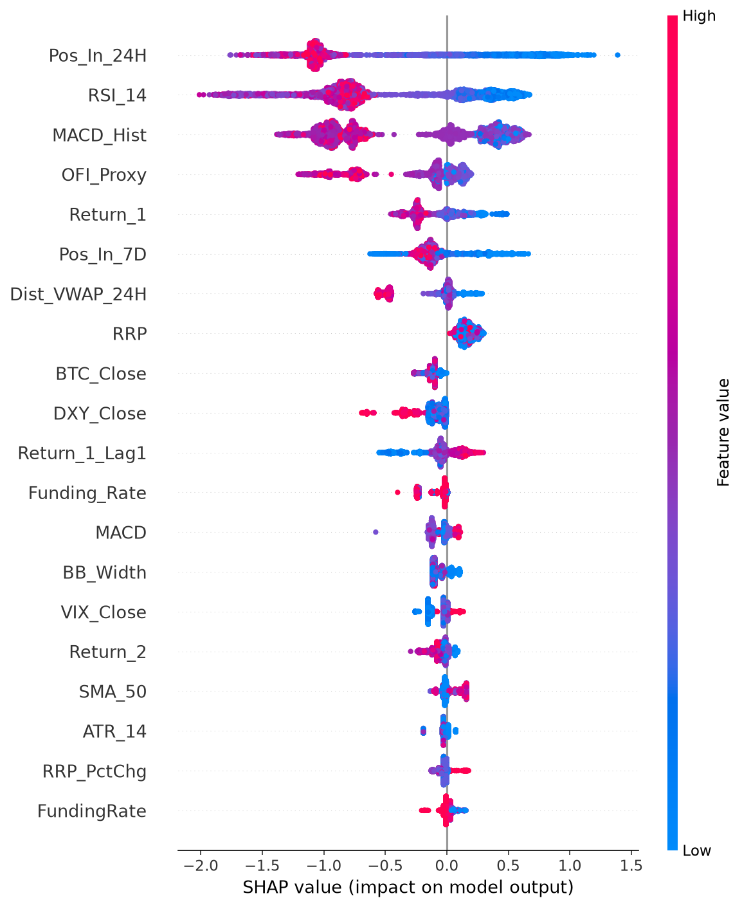
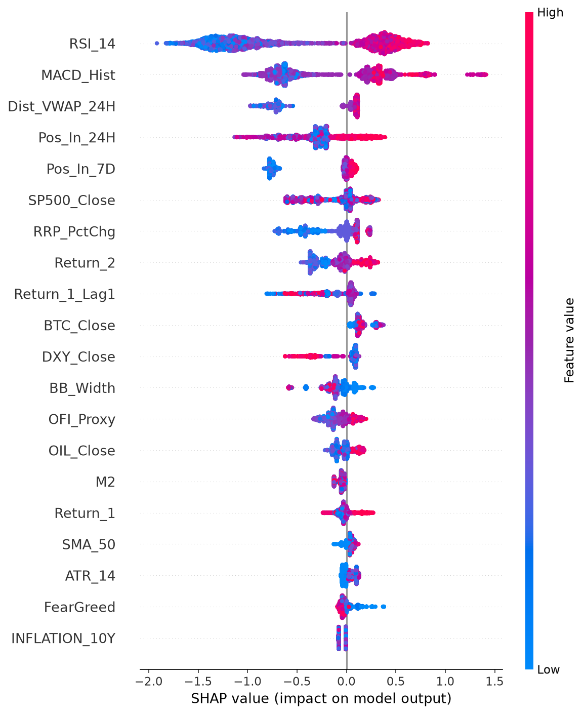

# 📊 Quant Research Report: ZECUSDT (Long/Short Dual Model)

## 1. ⚙️ การตั้งค่าที่ให้ผลลัพธ์ดีที่สุด (Best Configuration)
- **Take Profit (TP):** 35.0%
- **Stop Loss (SL):** 26.0%
- **ความแม่นยำรวม (Precision ในรอบเทรน):** 5.21%

## 2. 📉 ผลการจำลองเทรดจริง (Realistic Trade Simulation)
จำลองแบบเปิด 1 ไม้ เดินหน้าหาจุด TP/SL จริงๆ ไม่เปิดซ้อนทับกัน (No Overlapping)
- **จำนวนไม้ทั้งหมด (Total Trades):** 103 (Long: 64, Short: 39)
- **ชนะ (Wins):** 70
- **แพ้ (Losses):** 33
- **Win Rate รวม:** 67.96%

## 3. 🧠 SHAP Values (Explainable AI)
วิเคราะห์ว่า Feature แต่ละตัวส่งผลอย่างไรต่อการตัดสินใจของโมเดล (จุดสีแดง = ค่าสูง, จุดสีน้ำเงิน = ค่าต่ำ)

### ฝั่ง Long

### ฝั่ง Short

## 4. 🔍 ปัจจัยที่มีผลต่อการตัดสินใจมากที่สุด (Top Feature Importances)
1. **RSI_14** (Score: 0.1104)
2. **Pos_In_24H** (Score: 0.0987)
3. **MACD_Hist** (Score: 0.0399)
4. **Pos_In_7D** (Score: 0.0395)
5. **RRP_PctChg** (Score: 0.0372)
6. **BTC_Close** (Score: 0.0369)
7. **Return_1** (Score: 0.0362)
8. **OFI_Proxy** (Score: 0.0352)
9. **SMA_50** (Score: 0.0329)
10. **ATR_14** (Score: 0.0310)
