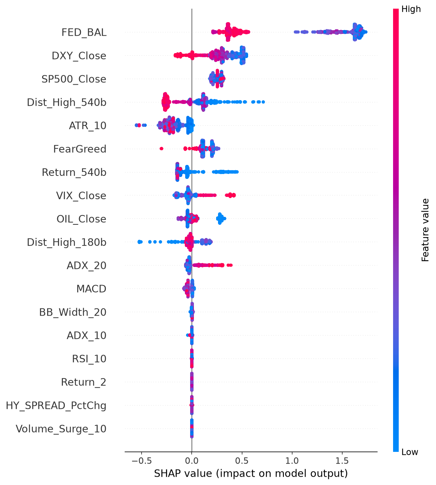
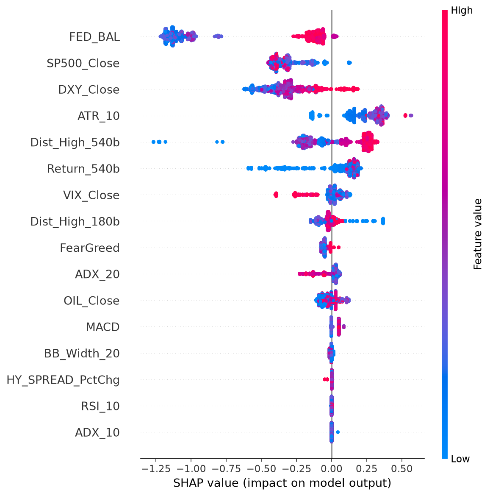

# 📊 Quant Research Report: ZECUSDT (Long/Short Dual Model)

## 1. ⚙️ การตั้งค่าที่ให้ผลลัพธ์ดีที่สุด (Best Configuration)
- **Take Profit (TP):** 30.0%
- **Stop Loss (SL):** 30.0%
- **ความแม่นยำรวม (Precision ในรอบเทรน):** 58.93%

## 2. 📉 ผลการจำลองเทรดจริง (Realistic Trade Simulation)
จำลองแบบเปิด 1 ไม้ เดินหน้าหาจุด TP/SL จริงๆ ไม่เปิดซ้อนทับกัน (No Overlapping)
- **จำนวนไม้ทั้งหมด (Total Trades):** 664 (Long: 619, Short: 45)
- **ชนะ (Wins):** 80
- **แพ้ (Losses):** 584
- **Win Rate รวม:** 12.05%

### 💰 ผลตอบแทนสุทธิ (Net — Kelly-sized, หักค่าธรรมเนียม/Slippage แล้ว | Rule #7 & #9)
- **เงินทุนเริ่มต้น (Initial Equity):** $10,000
- **เงินทุนสุดท้าย (Final Equity):** $1,795
- **ผลตอบแทนสุทธิรวม (Net Total Return):** -82.0%
- **Sharpe Ratio (annualized, net):** -1.41

## 3. 🧠 SHAP Values (Explainable AI)
วิเคราะห์ว่า Feature แต่ละตัวส่งผลอย่างไรต่อการตัดสินใจของโมเดล (จุดสีแดง = ค่าสูง, จุดสีน้ำเงิน = ค่าต่ำ)

### ฝั่ง Long

### ฝั่ง Short

## 4. 🔍 ปัจจัยที่มีผลต่อการตัดสินใจมากที่สุด (Top Feature Importances)
1. **OIL_Close** (Score: 0.1145)
2. **FED_BAL** (Score: 0.1083)
3. **FearGreed** (Score: 0.1049)
4. **DXY_Close** (Score: 0.1015)
5. **Return_540b** (Score: 0.0983)
6. **VIX_Close** (Score: 0.0817)
7. **ATR_10** (Score: 0.0760)
8. **SP500_Close** (Score: 0.0741)
9. **Dist_High_540b** (Score: 0.0581)
10. **Dist_High_180b** (Score: 0.0512)

## 5. 🔬 Walk-Forward Validation (Regime & Target Windows)

### Per-Year Performance

| Year | Trades | Win Rate | Net Return % (sum) |
|------|--------|----------|-----------------|
| 2021 | 88 | 13.6% | -13.7% |
| 2022 | 150 | 7.3% | -75.8% |
| 2023 | 97 | 6.2% | -52.3% |
| 2024 | 61 | 19.7% | +1.4% |
| 2025 | 172 | 14.5% | -30.7% |
| 2026 | 96 | 13.5% | +10.9% |

### Target-Window Coverage (did we catch the big moves?)

| Window | Trades inside | Net PnL % |
|--------|---------------|-----------|
| 2024-07-09 → 2024-08-24 | ✅ 3 | +8.1% |
| 2024-10-14 → 2024-12-08 | ✅ 3 | +13.1% |
| 2025-09-06 → 2025-11-16 | ✅ 36 | +25.9% |
| 2026-03-31 → 2026-05-24 | ✅ 19 | +14.4% |
| 2026-08-17 → open | ✅ 10 | +26.5% |
